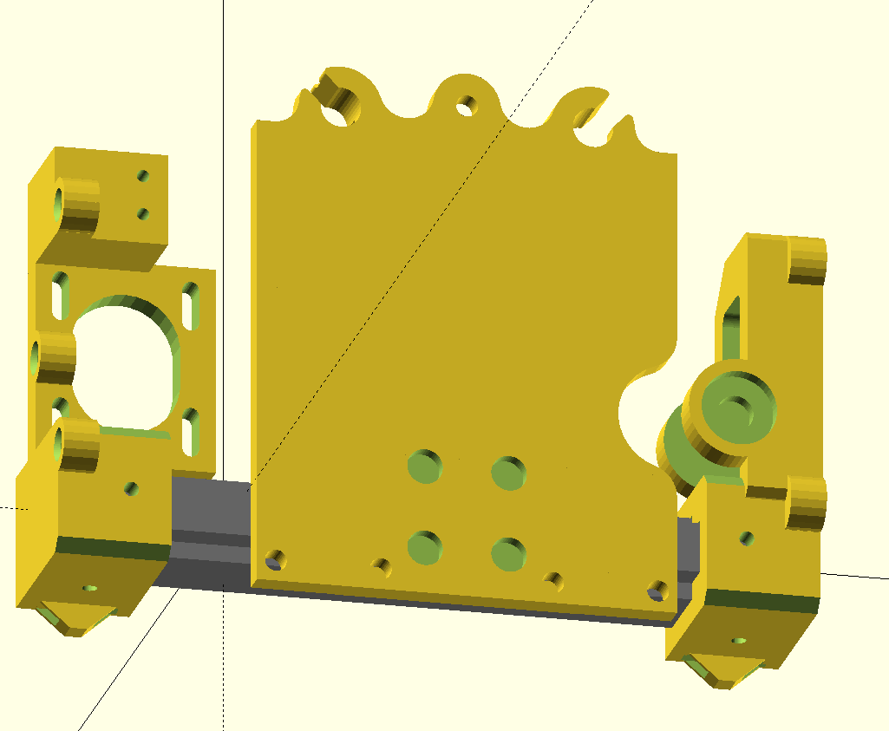

= TAZ5 Mods

== X Axis Linear Rail

The parts:

* `x_assembly.scad` - All parts modelled in here.
* `x_carriage.stl` - New carriage, press fit then bolted to rail carriage.
* `x_carriage_v2.0.stl` - LulzBot's original, unmodified file.
* `x_idler.stl` - New idler.
* `x_idler_v2.4.stl` - LulzBot's original, unmodified file.
* `x_motor_mount.stl` - New motor mount.
* `x_motor_mount_v2.2.stl` - LulzBot's original, unmodified file.

I used a 450mm MGN12H rail acquired off Amazon, bolted to 450mm aluminum extrusion for rigidity.
The total length of the assembly MUST BE 460mm, or there will be Z binding.
There's an extra 1mm clearance in the bottom of each extrusion cups, so don't bottom them out before tightening the bolts.

I bought 500mm extrusion and cut 50mm off with a bandsaw.
A hacksaw will do, this doesn't have to be extrememly precise.
The fits are tight, so you'll need to debur the edge with a file or it won't fit.

I used https://github.com/VoronDesign/Voron-2/blob/Voron2.4/STLs/Tools/MGN12_rail_guide_x2.stl[Voron 2.4's spacers] to make sure the rail is centered to the extrusion when installing.

Parts are printed in PETG with 80% infill and 7 perimiters, so the brackets are mostly solid where it matters.

Some prints require supports.
I've been using organic supports, but honestly I haven't had much luck with these and PETG.
The counterbores in the face-down side of the carriage are supported by a 0.2mm bridge built into the model.
You'll need to drill this out with 3mm drill bit or poke it out with a knife.

The carriage needs to be rigid.
Since the rail carriage is low, it can twist.
Granted, I did all this because my Igus bearings were probably shot, and even with light infill and PLA, there is less twist in this setup than there was before.

I used extrusion T-nuts and M3 socket head screws to put this together.
I think the rail screws were 6mm, and the sides were longer.

I reused the idler bearings and bolt, and the left-side end-stop switch.
I lost the little metal lever on it, but it seems to still work.

I used those crappy heat set inserts that are probably meant for injection molding.

There's enough play in the X Axis screw holes that you have to disable the steppers and relevel the X axis after installing this.
Be sure to level the X axis to the table first, before leveling the bed.

I tested the parts in PLA, then printed PETG.
When I switched over to the PETG parts, two of the PLA parts broke, and the motor mount was loose from heat around the washers.
Lesson: You can get a few weeks out of PLA if you need to, but it won't last.
